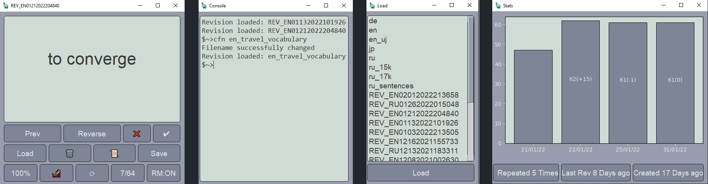

<h1> FLASHCARDS </h1>

<h1>Main Goal</h1>

Provide powerful tool to make learning languages effective, automated and smooth.

<h1>About</h1>
<ol>
<li>Allows loading datasets into a form of cards. Order is always randomized.</li>
<li>User is free to create their own datasets as long as they comply with the specific format (2 columns + headers). Example file is included in the distributed version of the app</li>
<li>In app, file is picked via a convenient side-window opened with a dedicated button. Only revisions and languages folders are searched.</li>
<li>It's possible to navigate between the cards as well as to change the side of the cards (question -> answer)</li>
<li>Subsets of cards from bigger sets can be saved as Revisions for further spaced repetitions</li>
<li>Spaced repetitons are reinforced by employing EFC (Ebbinghaus Forgetting Curve) that tells the user which sets they should repeat today</li>
<li>Revisions can be appraised - score is then recorded to the Database</li>
<li>In a revision mode, user can open a mistakes list side-window to see which cards they guessed wrong. Available with 'm' or score button.</li>
<li>User is also able to see statistics regarding currently loaded file - count of positives and time spent on each revision</li>
<li>With Flashcards Console Commands user is able to access some extra functionalities listed in README file that are also available via 'help' command directly in the console</li>
<li>Progress can be assessed with a 'Progress' chart displaying, in specified intervals, starting from top: total number of new words user failed to learn; sum of 'last positives' for Revisions created at this interval; total number of revisions regardless of the creation time</li>
</ol>

<h1>Tech Stack</h1>

Application was built with Python 3.8. Following libraries were employed:

<ol>
<li><b>pandas</b> - loading and manipulating files</li>
<li><b>numpy</b> - dependency for pandas</li>
<li><b>PyQt5</b> - Graphical User Interface</li>
<li><b>matplotlib</b> - statistics visualization</li>
</ol>

<h1>How to install?</h1>
    <ol>
        <li><b>For distributed application</b>: download archive from the provided link, unpack wherever convenient and keep all the files in one folder. </li>
        <li><b>For repository</b>:  clone repository, setup venv and install all libraries from requirements.txt. Please note that in order to run vbs launcher (allows running app without a console), absolute path mustn't contain spaces</li>
    </ol>

<h1>Keyboard Shortcuts</h1>
    <ol>
        <li><b>RIGHT</b>  -   navigate to the next card. If revision mode is on: also mark positive result </li>
        <li><b>LEFT</b>   -   navigate to the previous card</li>
        <li><b>UP</b>     -   reverse side of the currently displayed card</li>
        <li><b>DOWN</b>   -   in revision mode only - mark negative result and go to next card</li>
        <li><b>p</b>      -   change revision mode</li>
        <li><b>l</b>      -   open load side-window with all files stored in revisions and languages dirs</li>
        <li><b>e</b>      -   open efc side-window with reccommended revisions</li>
        <li><b>s</b>      -   open stats side-window with statistics concerning currently loaded revision</li>
        <li><b>c</b>      -   open console side-window allowing user to access the Flashcards Console Commands</li>
        <li><b>d</b>      -   delete currently displayed card. Does not modify the file itself</li>
        <li><b>m</b>      -   open mistakes side-window displaying all the cards user guessed wrong</li>
        <li><b>r</b>      -   reload the currently loaded file</li>
        <li><b>h</b>      -   open progress chart for current language</li>
        <li><b>q</b>      -   open settings</li>
        <li><b>esc</b>    -   close curretnly opened side-window</li>
    </ol>

<h1>Console Commands</h1>
All the commands are run via in-build console opened by pressing the 'c' key. Press INSERT to run the command.
    <ol>
        <li><b>help</b>    -   Says what it does - literally</li>
        <li><b>mct</b>     -   Modify Cards Text - edits current side of the card both in current set and in the original file</li>
        <li><b>mcr</b>     -   Modify Card Result - allows changing pos/neg for the current card</li>
        <li><b>dc</b>      -   Delete Card - deletes card both in current set and in the file</li>
        <li><b>lln</b>     -   Load Last N, loads N-number of words from the original file, starting from the end</li>
        <li><b>cfm</b>     -   Create Flashcards from Mistakes List - initiate new set from current mistakes and by default append to mistakes_list file</li>
        <li><b>efc</b>     -   Ebbinghaus Forgetting Curve - shows table with revs, days from last rev and efc score</li>
        <li><b>mcp</b>     -   Modify Config Parameter - allows modifications of config file</li>
        <li><b>sck</b>     -   Show Config Keys - list all available parameters in config file</li>
        <li><b>cls</b>     -   Clear Screen</li>
        <li><b>cfn</b>     -   Change File Name - changes currently loaded file_path, filename and all records in DB for this signature</li>
        <li><b>sah</b>     -   Show Progress Chart for all languages</li>
        <li><b>tts</b>     -   Shows amount of time (in hours) spent for lng in each interval</li>
    </ol>

<h1>Optional Features</h1>
    
 Select from the checkable combo box in Settings:

    <ol>
    <li><b>reccommend_new</b> - toogles reccomendations to create a new revision after some specified time</li>
    <li><b>keyboard_shortcuts</b></li>
    </ol>

<h1>To-Do</h1>
<ol>
<li>NEW FEATURES</li>
<li>Add LICENSE</li>
<li>write tests for SOD</li>
<li>paced-repetition - specific time for each card</li>
<li>EFC optimizer - ML based?</li>
<li>percentages on the chart instead of values</li>
<li>update readme and help commands to cover new features</li>
<li>PROJECT: send data to a website, where it can be compared between users</li>
<li>mobile version written in... golang?</li>
 
<ol
<li>FIXES AND UPGRADES</li>
<li>SOD - show last n in Queue - but how should it look like?</li>
<li>SOD - add Diki dictionary</li>
<li>SOD - add Cambridge dictionary</li>
</ol>
 
<ol>
<li>OPTIMIZATION</li>
<li>performance overhead - If word is a duplicate - show result from DB and only then prompt for online search</li>
<li>change rev_db format to something faster - feather</li>
<li>make saving to file a separate thread</li>
</ol>
<!--<li>don't post to fcc if sod is running - or post to status bar?</li>-->
<!-- <li>remeber size of side windows while in in-place mode</li> -->
<!-- <li>SOD - NoInternetConnection while queue mode - allow continue by only displaying a notification about Error - applicable to all types of errs</li> -->
<!-- <li>write tests for SOD - move MOCK dict to tests module and path the save_method</li>-->
<!--<li>auto cfm - modified SAVE button behavior - if is_revision, then appends mistakes list (with offset) to mistakes file in languages dir, manual write still possible via FCC</li> -->
<!-- <li>show time spent should be placed in separate console - bug: posting command to SOD</li> -->
<!--<li>dbinterface optimization - singleton, loading timing, cache, ... REMEMBER TO ASSESS PERFORMANCE</li>-->
<!-- <li>delegate theme setting to another config file</li> -->
<!-- <li>fix output.txt appearing when sod did not crash</li> -->
<!-- <li>SOD - remove items by index</li> -->
<!-- <li>abstract class for dicts - create new script</li>E -->
<!-- <li>add error handling to sod selection mode </liE> -->
<!-- <li>SOD - language switching, more info to status_bar </li> -->
<!-- <li>SOD - status bar</li> -->
<!-- <li>Show what was saved</li> -->
<!-- <li>lngs listed twice in load side-window</li> side_windows L:199 - Stopped occuring? -->
<!-- <li>sod -single manual entry in the queue</li> -->
<!-- <li>time - show only for selected lngs</li> -->
<!-- <li>lln with range e.g. lln 50 20 loads list[-50:-20] </li> -->
<!-- <li>don't save positives if not all cards where graded</li> -->
<!-- <li>summary - look for last non-empty, not only the last</li> -->
<!-- <li>reload elements when changing to side-by-side</li> -->
<!-- <li>show all cards as a (synchronized dual-)list - implement in mistakes list later on</li> -->
<!-- <li>SOD - phrase not saved after mofication of the orig phrase</li> -->
<!-- <li>--revision summary should stay in the set</li> -->
<!-- <li>create mock dictionary service</li> -->
<!-- <li>--singleton config</li> -->
<!-- <li>save with fix sides (0-EN, 1-PL</li> -->
<!-- <li>add 80% horizontal line on stat chart</li> -->
<!-- <li>Debug timer formatting</li> -->
<!-- <li>FCC - pull current card from the file - get random seed when loading?</li> -->
<!-- <li>periodically check if file was updated - add option to set interval or turn off</li> -->
<!-- <li>window resizing issued - forgetting origin size on side-window switch</li> -->
<!-- <li>record revision at any moment</li> -->
<!-- <li>GUI theme update - config cleanup </li> -->
<!-- <li>integrate SOD into fcs</li> -->
<!-- <li>open side window on top of the main - optional feature</li> -->
<!-- <li>dark theme</li> -->
<!-- <li>sod - que results scaling to width</li> -->

<h1>Known Bugs</h1>
<ol>
<li>If absolute path to the launcher (.vbs) contains whitespaces then the app will not launch and launcher.bat is to be recoursed to.</li>
</ol>
