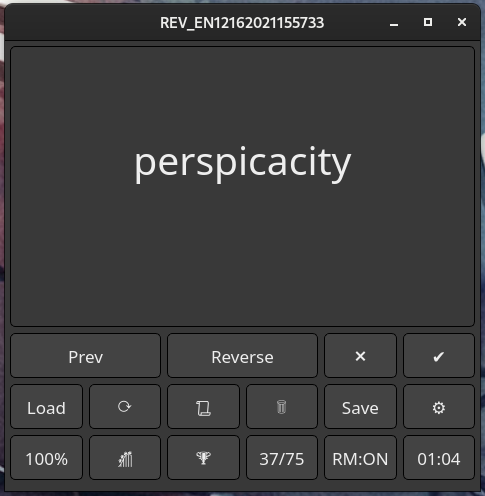
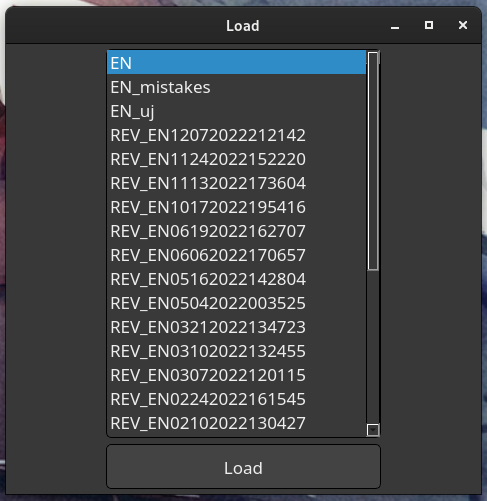
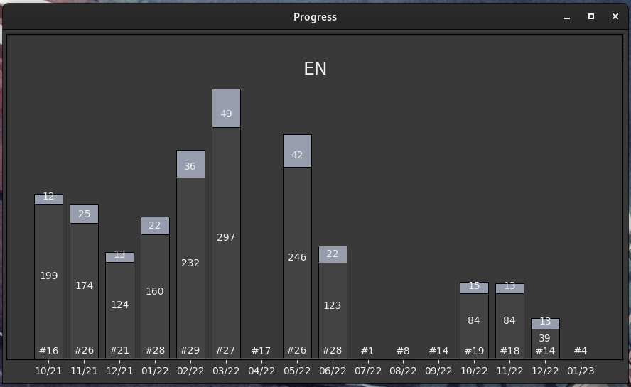
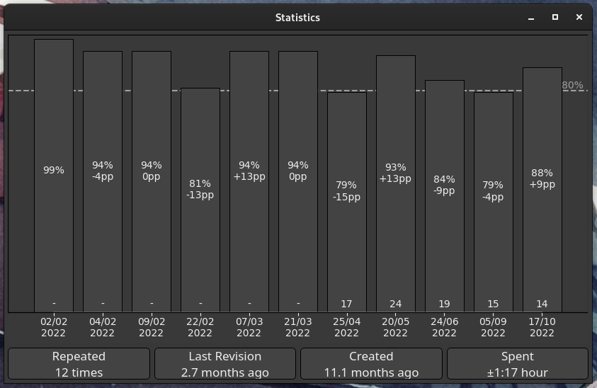
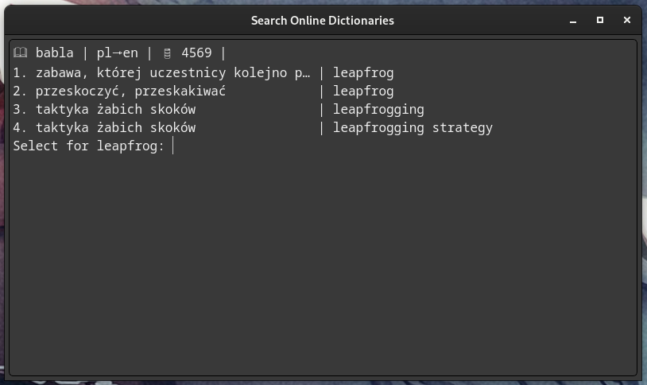
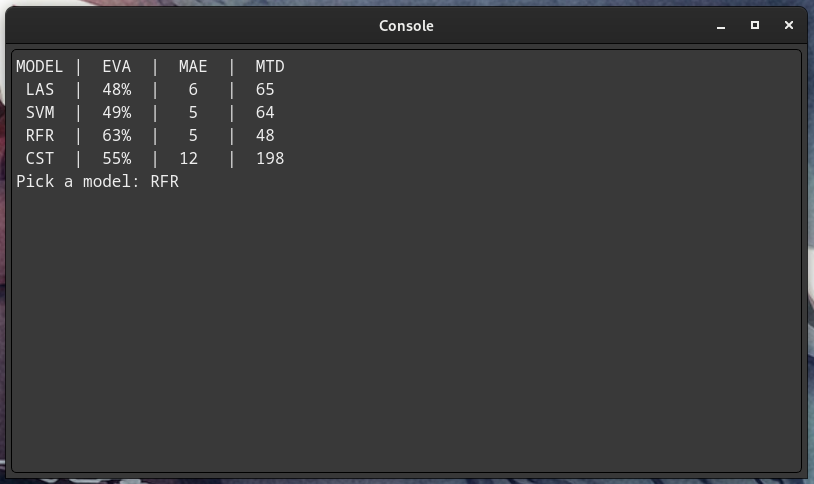
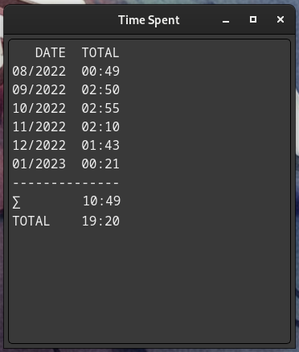
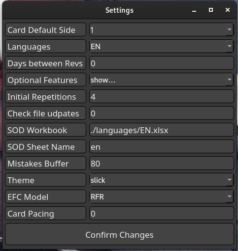

<h1> FLASHCARDS </h1>

<h1>Main Goal</h1>

Provide a powerful tool to make learning languages effective, automated and smooth.

<h1>About</h1>
<ol>
<li>Application allows loading datasets into a form of flashcards. Order of cards is always randomized</li>
<li>User is able to create their own language datasets (csv, xlsx)</li>
<li>It's possible to navigate between the cards as well as to change the side of the cards (question -> answer)</li>
<li>Subsets of cards from bigger datasets can be saved as Revisions for further spaced repetitions</li>
<li>Spaced repetitons are reinforced by employing EFC (Ebbinghaus Forgetting Curve) that tells the user which sets they should repeat now</li>
<li>Revisions can be appraised - score and time spent are then recorded to the Database and can be seen on Statistics, Progress and TimeSpent windows</li>
<li>In a revision mode, user can open a mistakes list side-window to see which cards they guessed wrong. After the revision, the mistakes list is converted to the flashcards, optionally saved to the special *_mistakes file</li>
<li>Once the Revision is complete, the user is presented with the Revision Summary - couple sentences evaluating the score</li>
<li>With Flashcards Console Commands user is able to access some extra functionalities listed via the 'help' command</li>
<li>Side Windows despite their name, can be opened in 1 of 2 modes: in-place or side-by-side. They are nonetheless integral parts of the main window. Size of the individual windows will be recorded to the config file.</li>
<li>Themes: list of themes is loaded from the scripts/resources/themes directory. User is free to add their own styles as long as they comply with the list of fields</li>
<li>New cards can be easily added to the dataset through an in-built SOD extension</li>
</ol>

<h1>Load Window</h1>

Allows picking both Revision and Language files from the specified directories. New Revisions can be created only from Languages and Revision Mode (Positive/Negative) is available only for the Revisions. If optional feature "reccomend_new" is selected, reminders to create a new revision will also appear there

<h1>Progress Window</h1>

Progress can be assessed with a 'Progress' chart displaying, in specified intervals, starting from top: total number of new words user failed to learn; sum of 'last positives' for Revisions created at this interval; total number of revisions regardless of the creation time. Only data for the languages selected in the settings will be diplayed

<h1>Statistics</h1>

Statistics shows scores for each time a particular Revision was done. Optionally, Cards Per Minute indicator can be shown instead of time-spent

<h1>Search Online Dictionaries</h1>

Search Online Dictionaries facilitates adding new words to the datasets via a command line interface - translation for the searched phrase are fetched from the online service and then filtered by the user to be finally saved to the file. There are several online dictionaries available of which list can be shown via the "help" command - a local source can also be used . Searched phrases can be Edited or Added if they don't suite the expectations out-of-the-box. If the searched phrase is already in the dataset, user will be notified about the duplicate

<h1>EFC Model Optimizer</h1>

EFC Model Optimizer employs regression models fitted on the Revision data and is used for fitting the EFC model to the user. EFC is meant to determine, after what time the predicted percentage of words still remembered falls below the defined threshold. First, statistics for each model are presented, then as selected, examples comparing True and Predicted values will be shown. If the model is accepted, it will be pickled and automatically set as the current model. Available models can be picked from the Settings menu

Available Models:

<ol>
<li>LAS - Lasso Regression</li>
<li>SVM - Support Vector Machine</li>
<li>RFR - Random Forest Regression</li>
<li>CST - custom model adjusted to fit the original EFC curve</li>
</ol>

<h1>Time Spent</h1>

Timers: there are 3 independent timers, recording time spent on a revision, monitoring changes in the source file and a Pace Timer switching cards after a specified time has passed. Timers will stop whenever the Application window is not selected or a side-window is opened.

<h1>Settings</h1>

Most important settings are available through this window, however some other options such as keyboard shortcuts are to be set directly in the config.ini file. Changing settings via this window does not require reloading the application

<h1>Tech Stack</h1>
<ol>
<li><b>Python3.11</b></li>
<li><b>PyQt5</b> - Graphical User Interface</li>
<li><b>matplotlib</b> - statistics visualization</li>
<li><b>beautifulsoup4</b> Search Online Dictionaries</li>
<li><b>scikit-learn</b> EFC Model Optimizer</li>
</ol>

<h1>How to install?</h1>
    <ol>
        <li><b>For distributed application</b>: download archive from the provided link, unpack wherever convenient and keep all the files in one folder. </li>
        <li><b>For repository</b>:  clone repository, setup venv and install all libraries from requirements.txt. Please note that in order to run vbs launcher (allows running app without a console), absolute path mustn't contain spaces</li>
    </ol>

<h1>Console Commands</h1>
All the commands are run via in-build console opened by pressing the 'c' key by default. Press RETURN to run the command.
    <ol>
        <li><b>help</b>: Gets Help</li>
        <li><b>mct</b>: Modify Cards Text - edits current side of the card both in current set and in the original file</li>
        <li><b>rcc</b>: Reverse Current Card - changes sides of currently displayed card and updates the source file</li>
        <li><b>mcr</b>: Modify Card Result - allows changing pos/neg for the current card</li>
        <li><b>dcc</b>: Delete Current Card - deletes card both in current set and in the file</li>
        <li><b>lln</b>: Load Last N, loads N-number of words from the original file, starting from the end</li>
        <li><b>cfm</b>: Create Flashcards from Mistakes List *[~] *[a/w] *[r/l]- initiate new set from current mistakes e.g cfm a r. "~" arg disables saving to file</li>
        <li><b>efc</b>: Ebbinghaus Forgetting Curve *N - shows table with revs, days from last rev and efc score; optional N for number of intervals. Additionaly, shows predicted time until the next revision</li>
        <li><b>mcp</b>: Modify Config Parameter - allows modifying the config file. Syntax: mcp *sub_dict key new_value</li>
        <li><b>sck</b>: Show Config Key: Syntax: sck *sub_dict key</li>
        <li><b>cls</b>: Clear Screen</li>
        <li><b>cfn</b>: Change File Name - changes currently loaded file_path, filename and all records in DB for this signature</li>
        <li><b>sah</b>: Show Progress Chart for all languages</li>
        <li><b>tts</b>: Total Time Spent *[last_n(1,2,3,...)] *[interval(m,d,y)] - shows amount of time (in hours) spent for each lng for each *interval. Default = 1 m</li>
        <li><b>scs</b>: Show Current Signature</li>
        <li><b>lor</b>: List Obsolete Revisions - returns a list of revisions that are in DB but not in revisions folder.</li>
        <li><b>sod</b>: Scrape online dictionary - *<word/s> *-d <dict name>. Default - curr card in google translate.</li>
        <li><b>gwd</b>: Get Window Dimensions</li>
        <li><b>pcc</b>: Pull Current Card - load the origin file and updates the currently displayed card</li>
        <li><b>sfs</b>: Set Font Size - sets font for current card and returns info on width, height and text len</li>
        <li><b>sod</b>: Scrape Online Dictionary - fetch data from online sources using a cli</li>
        <li><b>emo</b>: EFC Model Optimzer - employs regression and machine learning techniques to adjust efc model for the user needs</li>
        <li><b>rgd</b>: Reset Geometry Defaults</li>
        <li><b>err</b>: Raises an Exception</li>
        <li><b>add</b>: Add Card - appends a card to the current dataset. Does not modify the source file</li>
    </ol>

<h1>Optional Features</h1>
<ol>
<li>side_by_side: opens side-windows by widening the main window, instead of showing it on top</li>
<li>show_cpm_stats: on Statistics chart, displays CPM (Cards Per Minute) numbers instead of time spent</li>
<li>hide_timer: only displays icons on the Timer button instead of actual numbers</li>
<li>revision_summary: toggles display of the text apprasing the revision by %score, time, etc.</li>
<li>show_efc_line: show a horizontal line at the efc_threshold level specified in the config file</li>
<li>show_percent_stats: on Statistics chart, displays percentage scores and pp. diffrences instead of plain numbers</li>
<li>days_to_new_rev: After specified amount of days a notification prompting to create a new revision will be shown in the Load menu</li>
<li>pace_card_interval: Specifies amount of seconds between card switches. Set to 0 in order to disable the timer</li>
<li>file_update_interval: Specifies amount of seconds between checking for the source file changes. Set to 0 in order to disable the timer</li>
<li>initial_repetitions: Specifies amount of revisions that are supposed to be reccommended in 12 hours intervals, ignoring the EFC model</li>
<li>mistakes_buffer: Specifies amount of cards that are kept in the *_mistakes.csv files. The queue follows the FIFO logic</li>
<li>card_default_side: Specifies with side of the card is displayed first. Valid choices are: 1, 0, random</li>
<li>languages: determines list of languages in use, ignoring both data and files which does not have the LANGUAGE_ID matching</li>
<li>efc_threshold: if number of words "in-memory" falls below this level (based on EFC model), a new revision is reccommended.</li>
<li>timespent_len: count of months back that are shown on the TimeSpent window</li>
<li>emo_discretizer: which discretization function should EMO use: yeo-johnson, decision-tree</li>
<li>emo_cap_fold: determines the quantile cap on both sides of the data distribution</li>
<li>csv_sniffer: allows use of custom separators eg. ';,'. Defaults to a comma if turned off</li>
</ol>

<h1>To-Do</h1>
<ol>
<li>Done, for now...</li>
</ol>

<h1>Known Bugs</h1>
<ol>
<li>If absolute path to the launcher (.vbs) contains whitespaces then the app will not launch and launcher.bat is to be recoursed to</li>
</ol>
