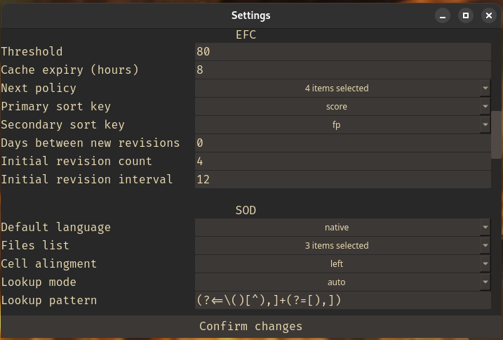

# FlashCards 1.5.0

- [FlashCards](#flashcards-150)
  - [Main Goal](#main-goal)
  - [About](#about)
  - [Load Window](#load-window)
  - [Progress Window](#progress-window)
  - [Statistics](#statistics)
  - [Dictionary](#dictionary)
  - [EFC Model Optimizer](#efc-model-optimizer)
  - [Time Spent](#time-spent)
  - [Monitoring](#monitoring)
  - [Settings](#settings)
  - [Final Actions and Next EFC](#final-actions-and-next-efc)
  - [Mistakes](#mistakes)
  - [Hiding Tips](#hiding-tips)
  - [Requirements](#requirements)
  - [How to install](#how-to-install)
  - [Console Commands](#console-commands)
  - [Optional Features](#optional-features)
  - [Known Bugs](#known-bugs)

## Main Goal
Provide a powerful tool to make learning languages effective, automated and smooth.

## About
1. Important files (src/res/*):
   - config.json - all user settings. Loaded once on the launch
   - db.csv - stores revisions history
   - themes - available styles. User is free to add new styles based on the provided examples
   - model.pkl - custom EFC model, trained to fit forgetting curve of the user [See: EMO](#efc-model-optimizer)
2. There are 5 *kinds* of flashcards files: 
    - *Language* - root source of all cards, created by the user
    - *Revision* - subsets from a *Language* file, subject of spaced repetitions managed by EFC
    - *Mistakes* - subsets of failed cards from *Revision* files
    - *Ephemeral* - temporary sets without actual files
    - *Unknown* - describes invalid or missing files
3. All *kinds* follow the same template: 
    | *TARGET_LANGUAGE_ID* | *SOURCE_LANGUAGE_ID* |
    | -------------------- | -------------------- |
    | 寿司                 | sushi                |
    | ...                  | ...                  |
4. Supported extensions for all *kinds* are '.csv' and '.xlsx' albeit both *Revisions* and *Mistakes* are by default created as '.csv'
5. Files are organized in the 'data' directory following the pattern data/*lng*/{rev,lng,mst}/*file*. Both *lng* and *file* actual names are chosen by the user and are later used together with their location (*kind*, *language*) for identification. If the configuration is referencing a missing directory tree, it will be created on the launch, however source file must be put by user. Alternatively, a 'clt' command can be used to generate both language tree and an example file
6. Once the *Language* file is there, it can be loaded in the app. Then the user will review multiple cards and press 'Save' which will create a new *Revision* file containing only cards seen. Pressing 'Save' during *Revision* will create an *Ephemeral* and if active file was reviewed more then *init_revs_cnt* times - save all failed cards to the *Mistakes* file
7. Spaced repetitons are reinforced by employing the EFC [See: Ebbinghaus Forgetting Curve](#efc-model-optimizer) that tells user which *Revision* they should repeat now, that is: Predicted % of words in-memory fell below the [efc_threshold](#optional-features)
8. *Revisions*, *Mistakes* and *Ephemerals* can be appraised - score, time spent, etc. are then recorded to the Database (src/res/db.csv) and can be viewed on Statistics, Progress and TimeSpent windows
9.  Once the *Revision* is complete, the user is presented with the Revision Summary - a couple of sentences evaluating the score
10. With [Flashcards Console Commands](#console-commands) user is able to access a multitude of extra functionalities listed via the 'help' command

## Load Window

- Allows picking all *kinds* of flashcard files that were matched by the 'languages' setting i.e. are on proper path. New *Revisions* can be created only from *Languages*. Revision Mode (Positive/Negative) is available only for the *Revisions*, *Mistakes* and *Ephemerals*. 
- If optional feature "recommend_new" is given a value greater than 0 (days), reminders to create a new revision will also appear there - specific texts can be customized in the 'recoms' section of the config
- Items are prefixed with a symbol hinting to their type. Initial *Revisions* are distinguished from Regular *Revisions*.
- Right clicking on a file opens a dialog that allows creating an *Ephemeral*. Index cache is applied if available. Custom ranges can be used.

## Progress Window

Progress can be assessed with a 'Progress' chart displaying, in specified intervals, starting from top: total number of new words user failed to learn (light grey); sum of 'last positives' for *Revisions* created at this interval (dark grey); total number of revisions regardless of the *creation time*. Only data for the languages selected in the settings will be diplayed

## Statistics

Statistics shows scores for each time currently loaded *Revision* was reviewed. Optionally, Cards Per Minute indicator can be shown instead of time-spent. 80% line reflects EFC threshold specified in the config and can be toggled via 'show_efc_line'

## Dictionary

Dictionary facilitates managing cards in the datasets via a command line interface - translation for the searched phrase are fetched from the online/local service and then filtered by the user to be finally saved to the file. There are several online dictionaries available of which list can be shown via the 'help' command - a local source can also be used. Searched phrases can be Edited or Added if they don't suite the expectations out-of-the-box. If the searched phrase is already in the dataset, user will be notified about the duplicate. Ultimately, a card can be added relying solely on the user input by entering the manual mode (manual_mode_sep)
- type \help to get a list of tips and available commands
- Lookup is available by selecting a part of the displayed card's text and clicking RMB. In the 'quick' mode a predicted hint will be displayed as a notification and on left click a complete query results will be displayed
- Using monospaced fonts with proper support for the used languages is advised
- It is normal for the separating line to not align perfectly, as shown above. It is due to different pixel widths of certain characters such as 車 compared to an 'a' (of which both have len()=1) or using non-monospaced fonts. To alleviate this issue, a Caliper is used to measure actual pixel widths of characters and pad the cell accordingly.
- Search is done one-way only, from the source to the target language, which is visible on the status bar and can be reversed with a prefix, and unless the default source language is set to "auto" it will be reverted after the operation is finished.

## EFC Model Optimizer

1. EFC Model Optimizer employs regression models fitted on the *Revision* data and is used for fitting the EFC model to the user's forgetting curve. EFC is meant to determine, after what time the predicted percentage of words still remembered falls below the defined EFC threshold. Model will only be created if count of records exceeds 'min_records'. 
2. Steps for creating the model:
     1. Select *Languages* to be included in the model
     2. Select the *Approach*:
        - Universal
        - Language-Specific - takes into account the *Language* of the *Revision*
     3. Statistics for each model are presented, then as selected, examples comparing True and Predicted values will be shown. 
     4. If the model is accepted, it will be pickled and automatically set as the current model
3. Available Models:
    - LAS - Lasso Regression
    - SVM - Support Vector Machine
    - RFR - Random Forest Regression
    - CST - custom model adjusted to fit the original EFC
4. Custom models are not shipped with the source code and unless created locally, a Standard CST Model will be used

## Time Spent

1. RevisionTimer for recording time spent during a *Revision*
2. Pace Timer for switching cards after a specified time has passed (turn off by setting to 0)
3. Timers will stop whenever the Application window is not selected or a side-window is opened

## Monitoring
1. FileMonitor is used to watch loaded files for changes
2. Watched files: current flashcards file, SOD source file
3. Turn off this setting by changing *allow_file_monitor* to false
4. If current file is only temporary, it will be saved as a tmpfcs.csv and loaded on next startup. This file is then removed
5. On application shutdown, a session snapshot is created and saved to cache.json; This is an equivalent of an auto-save

## Settings

- Most important settings are available through this window, however some other options such as keyboard shortcuts can be modified via:
   - 'mcp' command [See: mcp](#console-commands)
   - manually editing the config.json before the application launch

## Hiding Tips
- The Hiding Tips feature allows you to hide parts of the text that match a given regex pattern
- Policies are used to specify additional conditions. They are split into 3 levels:
  - Level 0: These settings take absolute precedence over any other settings
     - always, never
  - Level 1: Conditions at this level refer to the immutable state of the loaded file
     - regular_revision
  - Level 2: Flux Rules are applied only if Level 1 conditions match and are dynamically evaluated
     - new_card, foreign_side
- Policies are defined per *kind*. Some rules are only available for specific *kinds*
- Connector: used as a logical operator for Level 2 rules. Can be either *and* or *or*
- If a Hint is available for the current card, an indicator will be displayed in the bottom-right corner
- Hint can be revealed by pressing the *hint* shortcut

## Final Actions and Next EFC
- FlashCards strives to provide a seamless transition between datasets thus there are two types of actions that facilitate this process
- Final Actions are executed after pressing 'next' on the synopsis, after the revision is completed. Behaviour is controlled via "final_actions" parameter in config. This action can for example automatically create a *Revision* file from a *Language* or save mistakes from *Revision* and initiate an *Ephemeral* or suggest a next set
- Next EFC can be invoked at any moment to open a recommended set, unless 'require_saved' is set to True. Order and filters are controlled by the efc opt parameter.

## Mistakes
- Cards that received a negative score during the revision can be saved to *Mistakes* files
- This behaviour is controlled through Settings menu and by default it will only allow saving *Mistakes* from non-initial *Revisions*
- There is a rotation mechanism in place - each *Mistakes* file can have at most 'part_size' cards and if exceeded, files will be rotated and then the outstanding cards will be saved to a new file. Maximum number of files is set by 'part_cnt'

## Comprehensive Revision Mode
- In CRE mode, all revisions are scheduled for a review. Progress is tracked thoroughly
- On *next_efc* they will take precedence over other recommendations 
- While this mode is on, statistics will be gathered and presented after each *Revision* in a form of a short progress report
- Revisions can be scheduled in random or reversed order, according to the settings

## Requirements
- Python3.10
- Linux

## How to install
1. Clone repository
2. python -m venv venv
3. source venv/bin/activate
4. pip install -r src/res/requirements.txt
5. Run via launcher_linux.sh
6. On first run, application will validate setup and create required resources

## Console Commands
All the commands are run via in-build console opened by pressing the 'c' key by default. Press RETURN to run the command. 
| *Command* | *Description*                                                                                                                             |
| --------- | ----------------------------------------------------------------------------------------------------------------------------------------- |
| help      | Gets Help                                                                                                                                 |
| mct       | Modify Cards Text - edits current side of the card both in current set and in the original file                                           |
| rcc       | Reverse Current Card - changes sides of currently displayed card and updates the source file                                              |
| mcr       | Modify Card Result - allows changing pos/neg for the current card                                                                         |
| dcc       | Delete Current Card - deletes card both in current set and in the file                                                                    |
| sis       | Show ILN Statistics - display number of new cards for each cached set                                                                     |
| efc       | Ebbinghaus Forgetting Curve - Optional *SIGNATURES else select active - shows table with EFC data                                         |
| mcp       | Modify Config Parameter - allows modifications of config file. Syntax: mcp *{sub_dict} {key} {new_value}                                  |
| sck       | Show Config Key: Syntax: sck *{sub_dict} {key}                                                                                            |
| cls       | Clear Screen                                                                                                                              |
| cfn       | Change File Name - changes currently loaded file_path, filename and all records in DB for this signature                                  |
| sah       | Show Progress Chart for all languages                                                                                                     |
| scs       | Show Current Signature                                                                                                                    |
| lor       | List Obsolete Revisions - returns a list of *Revisions* that are in DB but not in *Revisions* folder.                                     |
| gwd       | Get Window Dimensions                                                                                                                     |
| pcc       | Pull Current Card - load the origin file and updates the currently displayed card                                                         |
| sod       | Scrape Online Dictionaries - fetch data from online sources using a cli                                                                   |
| emo       | EFC Model Optimizer - employs regression techniques to adjust efc model for the user needs                                                |
| rgd       | Reset Geometry Defaults                                                                                                                   |
| err       | Raises an Exception                                                                                                                       |
| add       | Add Card - appends a card to the current dataset. Does not modify the source file                                                         |
| gcw       | Get Character Width - returns actual width in pixels for a given glyph                                                                    |
| pcd       | Print Current Dataset - pretty prints all cards in the current dataset                                                                    |
| cac       | Clear Application Cache - *key^help - runs cache_clear on an optional key                                                                 |
| ssf       | Show Scanned Files - presents a list of all relevant files                                                                                |
| clt       | Create Language Tree - creates a directory tree for a new language and an example file                                                    |
| eph       | Create Ephemeral Mistakes - shows current mistakes as flashcards of type *Ephemeral*                                                      |
| cre       | Comprehensive Review - creates a queue from all revisions that can be traversed via consecutive command calls. Optional args: flush, stat |
| cfg       | Config - manage the config file. Arguments: save, load, restart                                                                           |
| dbg       | Debug - display debug info                                                                                                                |
| dmp       | Dump Session Data - save config, update cache and create a tmpfcs file                                                                    |
    

## Optional Features
| *Key*                         | *Description*                                                                                                               |
| ----------------------------- | --------------------------------------------------------------------------------------------------------------------------- |
| languages                     | determines list of languages in use, ignoring both data and files which does not have the LANGUAGE_ID matching              |
| efc_threshold                 | if number of words "in-memory" falls below this level (based on EFC model), a new revision is recommended.                  |
| show_cpm_stats                | on Statistics chart, displays CPM (Cards Per Minute) numbers instead of time spent                                          |
| hide_timer                    | only displays icons on the Timer button instead of actual numbers                                                           |
| revision_summary              | toggles display of the text apprasing the revision by %score, time, etc.                                                    |
| show_efc_line                 | show a horizontal line at the EFC threshold level specified in the config file                                              |
| show_percent_stats            | on Statistics chart, displays percentage scores and pp. diffrences instead of plain numbers                                 |
| days_to_new_rev               | After specified amount of days a notification prompting to create a new revision will be shown in the Load menu             |
| pace_card_interval            | Specifies amount of seconds between card switches. Set to 0 in order to disable the timer                                   |
| allow_file_monitor            | Toggles a watcher that automatically updates loaded files on source change                                                  |
| init_revs_cnt                 | Specifies amount of revisions that are supposed to be recommended in init_revs_inth hours intervals, ignoring the EFC model |
| init_revs_inth                | Hourly Interval between initial revisions, ignoring the EFC model                                                           |
| mistakes_buffer               | Specifies amount of cards that are kept in the *LNG*_mistakes_NUM.csv files. The queue follows the FIFO logic               |
| mistakes_review_interval_days | recommend the mistakes files to be reviewed each N days                                                                     |
| mistakes_part_cnt             | maximum number of *Mistakes* files. Automatic rotation and partitioning is applied                                          |
| mistakes_part_size            | limit the number of cards stored in one *Mistakes* file                                                                     |
| card_default_side             | Specifies with side of the card is displayed first. Valid choices are: 1, 0, random                                         |
| timespent_len                 | count of months back that are shown on the TimeSpent window                                                                 |
| emo_discretizer               | which discretization function should EMO use: yeo-johnson, decision-tree                                                    |
| emo_cap_fold                  | determines the quantile cap on both sides of the data distribution                                                          |
| csv_sniffer                   | allows use of custom separators eg. ';,'. Defaults to a comma if turned off                                                 |
| synopsis                      | text to be displayed after *Language* cards range is exceeded                                                               |
| recoms                        | key-value pairs specyfing encouraging texts for recommend_new entries                                                       |
| SOD files_list                | faciliate switching by specifying files available to SOD. Skipped if empty                                                  |
| hiding_tips                   | remove *pattern* from the displayed text by following the *policy*                                                          |
| final_actions                 | an action to be performed after pressing next_button on synopsis. Example: create an *ephemeral* from mistakes              |
| next_efc                      | on shortcut *next_efc* will load a recommended file by following the policy                                                 |
| sigenpat                      | defines pattern used for naming new *Revision* files. It is appended with NUM on creation                                   |
| min_eph_cards                 | minimum number of mistakes that triggers creation of an *Ephemeral*                                                         |

## Keyboard Shortcuts
| *Name*       | *Key*  | *Description*                                                  |
| ------------ | ------ | -------------------------------------------------------------- |
| next         | Right  | go to next card or mark as posivite                            |
| prev         | Left   | go to previous card                                            |
| negative     | Down   | mark current card as negative                                  |
| reverse      | Up     | reverse side of the current card                               |
| del_cur_card | d      | remove current card from the set (does not affect source file) |
| load_again   | r      | load again the current set                                     |
| timespent    | t      | open TimeSpent sidewindow                                      |
| progress     | p      | open Progress sidewindow                                       |
| config       | q      | open Settings sidewindow                                       |
| fcc          | c      | open Console sidewindow                                        |
| efc          | e      | open EFC sidewindow                                            |
| load         | l      | open Load sidewindow                                           |
| mistakes     | m      | open Mistakes sidewindow                                       |
| stats        | s      | open Statistics sidewindow                                     |
| next_efc     | n      | load next recommendation                                       |
| run_command  | Insert | placeholder. Executed on 'Enter'                               |
| save         | w      | save current file or create a revision                         |
| sod          | f      | open SOD sidewindow                                            |
| hint         | h      | show a hint for current card                                   |
| last_seen    | g      | go to the last seen card                                       |

## ToDo
- support for Windows

## Known Bugs
A lot, but I'll fix'em ;)
