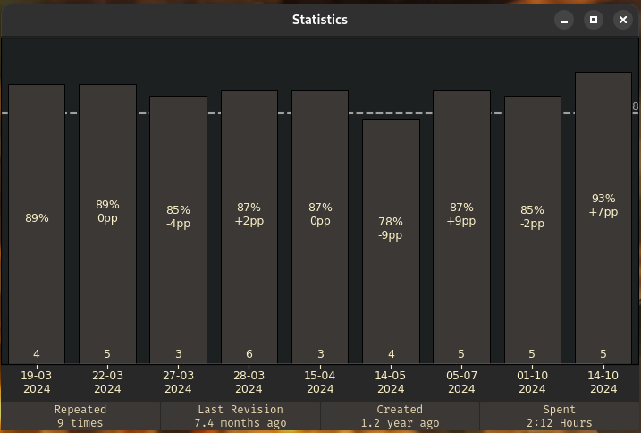
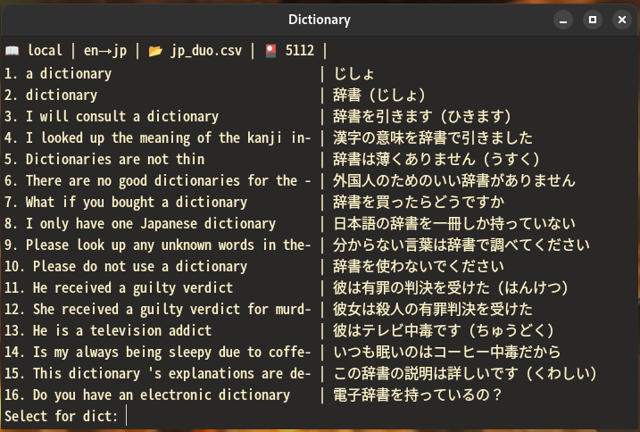

# FlashCards 1.3.12

- [FlashCards](#flashcards-137)
  - [Main Goal](#main-goal)
  - [About](#about)
  - [Load Window](#load-window)
  - [Progress Window](#progress-window)
  - [Statistics](#statistics)
  - [Search Online Dictionaries](#search-online-dictionaries)
  - [EFC Model Optimizer](#efc-model-optimizer)
  - [Time Spent](#time-spent)
  - [Settings](#settings)
  - [Requirements](#requirements)
  - [How to install](#how-to-install)
  - [Console Commands](#console-commands)
  - [Optional Features](#optional-features)
  - [Known Bugs](#known-bugs)

## Main Goal
Provide a powerful tool to make learning languages effective, automated and smooth.

## About
1. Important files (src/res/*):
   - config.json - all user settings. Loaded once on the launch
   - db.csv - stores information on *Revisions* and *Mistakes*
   - themes - available styles. User is free to add new styles based on the provided examples
   - model.pkl - custom EFC model, trained to fit forgetting curve of the user [See: EMO](#efc-model-optimizer)
2. There are 5 *kinds* of flashcards files: 
    - *Language* - root source of all cards, created by the user
    - *Revision* - subsets from a *Language* file, subject of spaced repetitions managed by EFC
    - *Mistakes* - subsets of failed cards from *Revision* files
    - *Ephemeral* - temporary sets without actual files
    - *Unknown* - describes invalid or missing files
3. All *kinds* follow the same template e.g.: 
    | *JP* | *EN*  |
    |------|-------|
    | 寿司  | sushi |
    | ...  | ...  |
4. Supported extensions for all *kinds* are '.csv' and '.xlsx' albeit both *Revisions* and *Mistakes* are by default created as '.csv'
5. Files are organized in the 'data' directory following the pattern data/*lng*/{rev,lng,mst}/*file*. Both *lng* and *file* actual names are chosen by the user and are later used together with their location (*kind*, *language*) for identification. If the configuration is referencing a missing directory tree, it will be created on the launch, however source file must be put by user. Alternatively, a 'clt' command can be used to generate both language tree and an example file
6. Once the *Language* file is there, it can be loaded in the app. Then the user will review multiple cards and press 'Save' which will create a new *Revision* file containing only cards seen. Pressing 'Save' during *Revision* will create an *Ephemeral* and if active file was reviewed more then *init_revs_cnt* times - save all failed cards to the *Mistakes* file
7. Spaced repetitons are reinforced by employing the EFC [See: Ebbinghaus Forgetting Curve](#efc-model-optimizer) that tells user which *Revision* they should repeat now, that is: Predicted % of words in-memory fell below the [efc_threshold](#optional-features)
8. *Revisions* and *Mistakes* can be appraised - score, time spent and other are then recorded to the Database (src/res/db.csv) and can be eventually viewed on Statistics, Progress and TimeSpent windows
9.  Once the *Revision* is complete, the user is presented with the Revision Summary - couple sentences evaluating the score
10. With [Flashcards Console Commands](#console-commands) user is able to access multitude of extra functionalities listed via the 'help' command

## Load Window

- Allows picking all *kinds* of flashcard files that were matched by the 'languages' setting i.e. are on proper path. New *Revisions* can be created only from *Languages* and Revision Mode (Positive/Negative) is available only for the *Revisions* and *Mistakes*. 
- If optional feature "recommend_new" is given a value greater than 0 (days), reminders to create a new revision will also appear there - specific texts can be customized in the 'RECOMMENDATIONS' section of the config

## Progress Window

Progress can be assessed with a 'Progress' chart displaying, in specified intervals, starting from top: total number of new words user failed to learn (light grey); sum of 'last positives' for *Revisions* created at this interval (dark grey); total number of revisions regardless of the *creation time*. Only data for the languages selected in the settings will be diplayed

## Statistics

Statistics shows scores for each time currently loaded *Revision* was reviewed. Optionally, Cards Per Minute indicator can be shown instead of time-spent. 80% line reflects 'efc_threshold' specified in the config and can be toggled via 'show_efc_line'

## Search Online Dictionaries

Search Online Dictionaries facilitates managing cards in the datasets via a command line interface - translation for the searched phrase are fetched from the online/local service and then filtered by the user to be finally saved to the file. There are several online dictionaries available of which list can be shown via the 'help' command - a local source can also be used. Searched phrases can be Edited or Added if they don't suite the expectations out-of-the-box. If the searched phrase is already in the dataset, user will be notified about the duplicate. Ultimately, a card can be added relying solely on the user input by entering the manual mode (manual_mode_sep)
- type \help to get a list of tips and available commands
- It is normal for the separating line not to align perfectly, as shown above. It is due to different pixel widths of certain characters such as 車 compared to an 'a' (of which both have len()=1) or using non-monospaced fonts. To alleviate this issue, a Caliper is used to measure actual pixel widths of characters and pads the cell with \u2009 (half-width space) instead of \u0020 (normal whitespace) as some fonts may remain in the asian input mode thus using double-width space.

## EFC Model Optimizer

1. EFC Model Optimizer employs regression models fitted on the *Revision* data and is used for fitting the EFC model to the user's forgetting curve. EFC is meant to determine, after what time the predicted percentage of words still remembered falls below the defined efc_threshold. Model will only be created if count of records exceeds 'min_records'. 
2. Steps for creating the model:
     1. Select *Languages* to be included in the model
     2. Select the *Approach*:
        - Universal
        - Language-Specific - takes into account the *Language* of the *Revision*
     3. Statistics for each model are presented, then as selected, examples comparing True and Predicted values will be shown. 
     4. If the model is accepted, it will be pickled and automatically set as the current model
3. Available Models:
    - LAS - Lasso Regression
    - SVM - Support Vector Machine
    - RFR - Random Forest Regression
    - CST - custom model adjusted to fit the original EFC
4. Custom models are not shipped with the source code and unless created locally, a Standard CST Model will be used

## Time Spent

1. There are 3 independent timers available for:
   - Recording time spent during a *Revision*
   - Monitoring changes in the source file (optional, turn off by setting to 0)
   - Pace Timer for switching cards after a specified time has passed (optional, turn off by setting to 0)
2. Timers will stop whenever the Application window is not selected or a side-window is opened

## Settings

- Most important settings are available through this window, however some other options such as keyboard shortcuts can be modified via:
   - 'mcp' command [See: mcp](#console-commands)
   - manually editing the config.json before the application launch

## Requirements
- Python3.10+
- Linux/Windows

## How to install
1. Clone repository
2. python -m venv venv
3. source venv/bin/activate
4. pip install -r src/res/requirements.txt
5. Run via either launcher_\*.\* or ``python src/init.py`` (follow with an '&' to disown the process)
6. On first run, application will validate setup and create required resources

## Console Commands
All the commands are run via in-build console opened by pressing the 'c' key by default. Press RETURN to run the command. 
- help - Gets Help
- mct - Modify Cards Text - edits current side of the card both in current set and in the original file
- rcc - Reverse Current Card - changes sides of currently displayed card and updates the source file
- mcr - Modify Card Result - allows changing pos/neg for the current card
- dcc - Delete Current Card - deletes card both in current set and in the file
- lbi - Load By Index, loads a range of cards. Syntax: start_index *end_index
- iln - Incremental Last N - executes *lbi* with parameters stored in cache. Syntax: *lim_cards
- efc - Ebbinghaus Forgetting Curve *N - shows table with revs, days from last rev and efc score; optional N for number of *Revisions* displayed. Additionaly, shows predicted time until the next revision,
- mcp - Modify Config Parameter - allows modifications of config file. Syntax: mcp *{sub_dict} {key} {new_value}
- sck - Show Config Key: Syntax: sck *{sub_dict} {key}
- cls - Clear Screen
- cfn - Change File Name - changes currently loaded file_path, filename and all records in DB for this signature
- sah - Show Progress Chart for all languages
- scs - Show Current Signature
- lor - List Obsolete Revisions - returns a list of *Revisions* that are in DB but not in *Revisions* folder.
- gwd - Get Window Dimensions
- pcc - Pull Current Card - load the origin file and updates the currently displayed card
- sod - Scrape Online Dictionaries - fetch data from online sources using a cli
- emo - EFC Model Optimizer - employs regression techniques to adjust efc model for the user needs
- rgd - Reset Geometry Defaults
- err - Raises an Exception
- add - Add Card - appends a card to the current dataset. Does not modify the source file
- gcw - Get Character Width - returns actual width in pixels for a given glyph
- pcd - Print Current Dataset - pretty prints all cards in the current dataset
- cac - Clear Application Cache - *key^help - runs cache_clear on an optional key
- ssf - Show Scanned Files - presents a list of all relevant files
- clt - Create Language Tree - creates a directory tree for a new language and an example file
- eph - Create Ephemeral Mistakes - shows current mistakes as flashcards
- cre - Comprehensive Review - creates a queue from all revisions that can be traversed via consecutive command calls. Optional args: flush, reversed|autosave|autonext {true,false}, stat
    

## Optional Features
- languages: determines list of languages in use, ignoring both data and files which does not have the LANGUAGE_ID matching
- efc_threshold: if number of words "in-memory" falls below this level (based on EFC model), a new revision is recommended.
- side_by_side: opens side-windows by widening the main window, instead of showing it on top
- show_cpm_stats: on Statistics chart, displays CPM (Cards Per Minute) numbers instead of time spent
- hide_timer: only displays icons on the Timer button instead of actual numbers
- revision_summary: toggles display of the text apprasing the revision by %score, time, etc.
- show_efc_line: show a horizontal line at the efc_threshold level specified in the config file
- show_percent_stats: on Statistics chart, displays percentage scores and pp. diffrences instead of plain numbers
- days_to_new_rev: After specified amount of days a notification prompting to create a new revision will be shown in the Load menu
- pace_card_interval: Specifies amount of seconds between card switches. Set to 0 in order to disable the timer
- file_update_interval: Specifies amount of seconds between checking for the source file changes. Set to 0 in order to disable the timer
- init_revs_cnt: Specifies amount of revisions that are supposed to be recommended in init_revs_inth hours intervals, ignoring the EFC model
- init_revs_inth: Hourly Interval between initial revisions, ignoring the EFC model
- mistakes_buffer: Specifies amount of cards that are kept in the *_mistakes.csv files. The queue follows the FIFO logic
- card_default_side: Specifies with side of the card is displayed first. Valid choices are: 1, 0, random
- timespent_len: count of months back that are shown on the TimeSpent window
- emo_discretizer: which discretization function should EMO use: yeo-johnson, decision-tree
- emo_cap_fold: determines the quantile cap on both sides of the data distribution
- csv_sniffer: allows use of custom separators eg. ';,'. Defaults to a comma if turned off
- after_face: text to be displayed after *Language* cards range is exceeded
- RECOMMENDATIONS: key-value pairs specyfing encouraging texts for recommend_new entries

## Known Bugs
A lot, but I'll fix'em ;)
